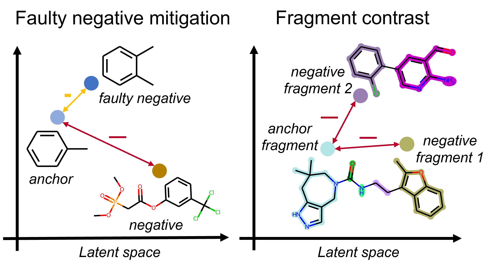

## Improving Molecular Contrastive Learning via Faulty Negative Mitigation and Decomposed Fragment Contrast ## 

#### Journal of Chemical Information and Modeling [[Paper]](https://pubs.acs.org/doi/full/10.1021/acs.jcim.2c00495) [[arXiv]](https://arxiv.org/abs/2202.09346) [[PDF]](https://arxiv.org/pdf/2202.09346.pdf) </br> 
[Yuyang Wang](https://yuyangw.github.io/), [Rishikesh Magar](https://www.linkedin.com/in/rishikesh-magar), Chen Liang, [Amir Barati Farimani](https://www.meche.engineering.cmu.edu/directory/bios/barati-farimani-amir.html) </br> Carnegie Mellon University </br>



This is the offical implementation of <strong><em>iMolCLR</em></strong>: ["Improving Molecular Contrastive Learning via Faulty Negative Mitigation and Decomposed Fragment Contrast"](https://pubs.acs.org/doi/full/10.1021/acs.jcim.2c00495). 
If you find our work useful in your research, please cite:

```
@article{wang2022improving,
  title={Improving Molecular Contrastive Learning via Faulty Negative Mitigation and Decomposed Fragment Contrast},
  author={Wang, Yuyang and Magar, Rishikesh and Liang, Chen and Farimani, Amir Barati},
  journal={Journal of Chemical Information and Modeling},
  volume={59},
  number={8},
  pages={3370--3388},
  year={2022},
  publisher={ACS Publications},
  doi={10.1021/acs.jcim.2c00495}
}

@article{wang2022molclr,
  title={Molecular contrastive learning of representations via graph neural networks},
  author={Wang, Yuyang and Wang, Jianren and Cao, Zhonglin and Barati Farimani, Amir},
  journal={Nature Machine Intelligence},
  pages={1--9},
  year={2022},
  publisher={Nature Publishing Group},
  doi={10.1038/s42256-022-00447-x}
}
```

## Getting Started

### Installation

Set up conda environment and clone the github repo

```
# create a new environment
$ conda create --name imolclr python=3.7
$ conda activate imolclr

# install requirements
$ pip install torch==1.7.1+cu110 torchvision==0.8.2+cu110 -f https://download.pytorch.org/whl/torch_stable.html
$ pip install torch-geometric==1.6.3 torch-sparse==0.6.9 torch-scatter==2.0.6 -f https://pytorch-geometric.com/whl/torch-1.7.0+cu110.html
$ pip install PyYAML
$ conda install -c conda-forge rdkit=2021.09.1 
$ conda install -c conda-forge tensorboard

# clone the source code of iMolCLR
$ git clone https://github.com/yuyangw/iMolCLR.git
$ cd iMolCLR
```

### Dataset

You can download the pre-training data and benchmarks used in the paper [here](https://drive.google.com/file/d/1aDtN6Qqddwwn2x612kWz9g0xQcuAtzDE/view?usp=sharing) and extract the zip file under `./data` folder. The data for pre-training can be found in `pubchem-10m-clean.txt`. All the databases for fine-tuning are saved in the folder under the benchmark name. You can also find the benchmarks from [MoleculeNet](https://moleculenet.org/).

### Pre-training

To train the iMolCLR, where the configurations are defined in `config.yaml`
```
$ python imolclr.py
```

To monitor the training via tensorboard, run `tensorboard --logdir ckpt/{PATH}` and click the URL http://127.0.0.1:6006/.

### Fine-tuning 

To fine-tune the iMolCLR pre-trained model on downstream molecular benchmarks, where the configurations are defined in `config_finetune.yaml`
```
$ python finetune.py
```

### Pre-trained model

We also provide a pre-trained model, which can be found in `ckpt/pretrained`. You can load the model by change the `fine_tune_from` variable in `config_finetune.yaml` to `pretrained`.
